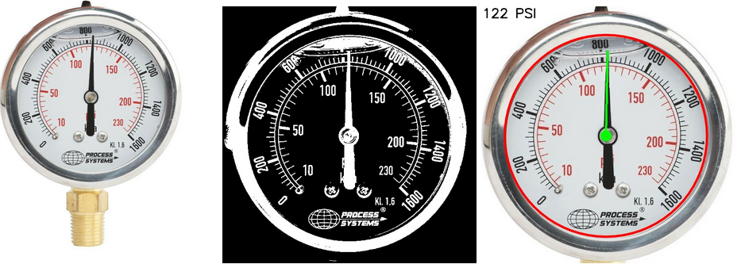
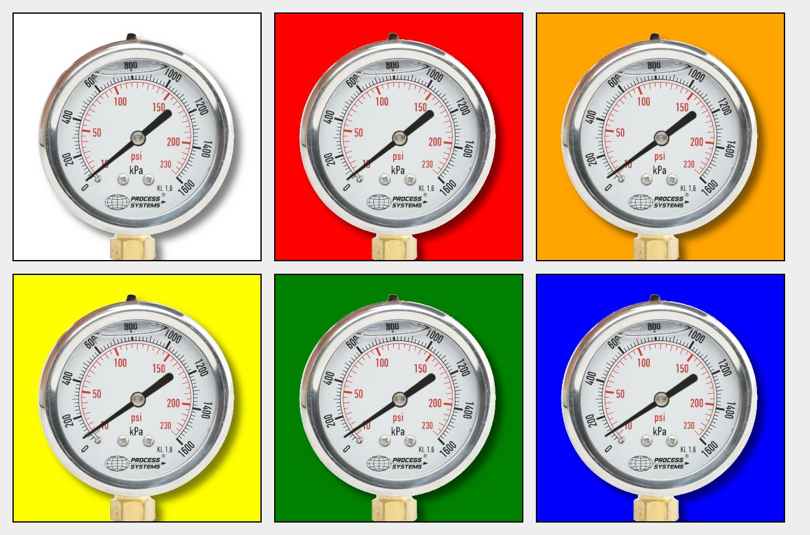

## Read Analogue Gauges With Machine Learning on AWS

Analogue pointer-type dials are widely applied in many industries such as Oil & Gas. Visual inspection to remote oil well sites is necessary to obtain readings from analog gauges. This means a human operator must travel to the gauge’s location, read its current value, and log that value to enable the data to be used elsewhere. This is a time consuming and expensive process and it is prone to human errors. An alternative to the manual readings is to record a video of the gauge and analyze the pressure variations using computer vision techniques. This project shows how to use AWS IoT services to read analogue gauges remotely.

The [Read Analogue Gauges With Machine Learning on AWS](https://aws-computer-vision.jacobcantwell.com/) workshop walks you through the end-to-end process for building analogue gauges (real and virtual), generating training data for use with AWS machine learning services including Amazon SageMaker and Amazon Rekognition, building a machine learning model that can detect and read different gauge types, deploying the model on the cloud and on edge devices, converting gauge image data to usable digital telemetry, and presenting the telemetry on a centralized digital dashboard. This end-to-end process can be reused for training your own models for similar machine learning projects.

## Analogue Gauge Builder

Create your own virtual analogue gauges in the [Analogue Gauge Builder](gauge/?g=bp100,bp200,bp50,bp75,bp60,bp100) website.

## Agenda

* Virtual - Send mock AWS analogue telemetry to AWS IoT
* Virtual - Build real time analogue gauges Kibana
* Virtual or Real - Take screen captures of the analog gauges for training data
* Deploy a sample model that can detect a Kibana gauge on a Deeplens camera
* Label the images with Amazon Sagemaker ground truth
* Build a custom model with Sagemaker that can read the gauge values
* Invoke an endpoint client
* View the real time dashboard with dial data
